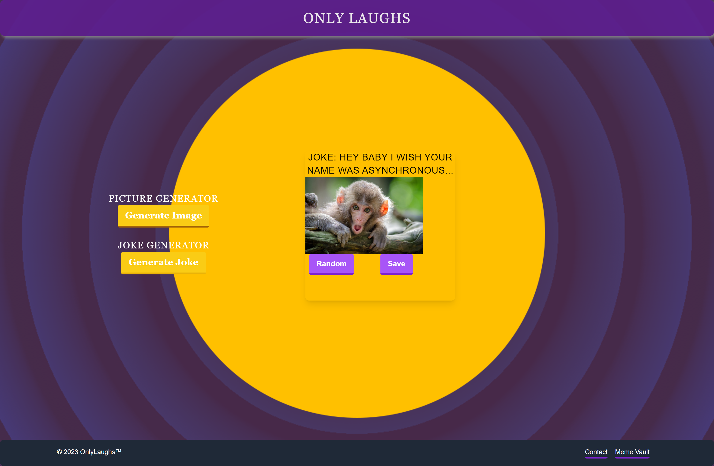
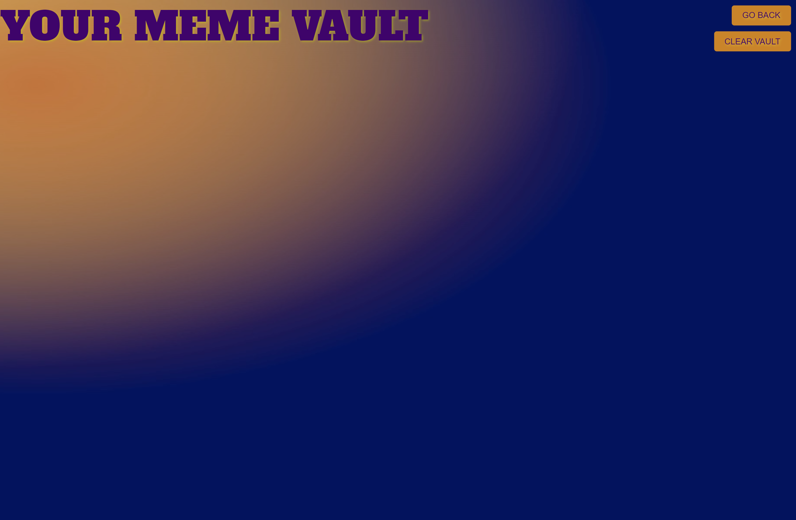

# ONLY LAUGHS!  

## User Story

AS A person looking to brighten my day
I WANT to go to a webpage that generates memes and jokes randomly
SO THAT I can make myself and other people laugh

## Description

In this repository, you will find the source code of the Only Laughs website. You will also find three HTML files, two functioning JavaScript files, and three CSS files all filled with laughs! The source code contains fully functional generator buttons, links to different pages, two API keys, TailwindCSS styles, as well as a save button which will be explained more in depth in the following:

## Welcome to ONLY LAUGHS!  

This website is a fun user friendly experience created to provide a spark of fun to your day.

## Instructions

Once you enter our landing page, you will find dynamically styled interface that may even appear a bit nostalgic. Other than the title that lets you know you've come to the right place, you will notice there are a couple of buttons to interact with.

The first button to the left is labeled "Picture Generator" and beneath that you will find a similiar button labeled "Joke Generator".
Now this is where the fun truly begins...

Upon pressing the Picture generator you will quicky see a picture loaded to the screen thanks to our partnership with Unsplash API. 
By itself this may not seem overly impressive but when you then couple that with clicking the Joke generator button a joke will materialize above the picture thanks to our fun friends the DEV JOKE API whose jokes are all geared towards developers.

Now you have generated in the center of the screen a brand new meme!  

Everyone has a unique sense of humor so from here you have a choice to save this newly generated meme to your "Meme Vault" or continue to follow the previous steps to create a meme that you are more inclined to preserve.

Should you choose to save a generated meme, you will be able to view your creations that you have chosen to save simply by clicking the Meme Vault button that will take you to the MEME VAULT page which contains all of your saved memes. 

From here, you can always push the "go back" button to navigate directly back to the Meme Generator homepage.
And hey if your just here for some random fun and looking to be surprised by what may be generated, simply click the randomizer button and a joke and picture will randomly be chosen from their respective APIs creating a completely random meme!

So please enjoy our website and if you are interested in contacting us, the developers of this site, check out our contacts page by clicking Contacts at the bottom of our landing page.

There you will find information to contact us individually by clicking the links to our profile pages containing links to other projects and various ways to contact us should you want to reach out. We hope you enjoy what we've created!

## Technologies Used

HTML
CSS
TailWindCSS
Joke API 
Picture API
JavaScript

## Screenshots

Home page:

Meme Vault:

Contact:

## Contact

[Anthony Buffill](https://github.com/AnthonyBuffill) - HTML CSS for MEME VAULT

[Hye-Ji Shin](https://github.com/shinhye-ji) - HTML CSS TailwindCSS for Contact 

[Brian Doherty](https://github.com/Bdoherty1) - HTML CSS TailwindCSS for Home

[Joshua Roth](https://github.com/JoshRTheDeveloper) - JavaScript for MEME VAULT and Home

## Live Link

[Live](https://anthonybuffill.github.io/only-laughs/)

